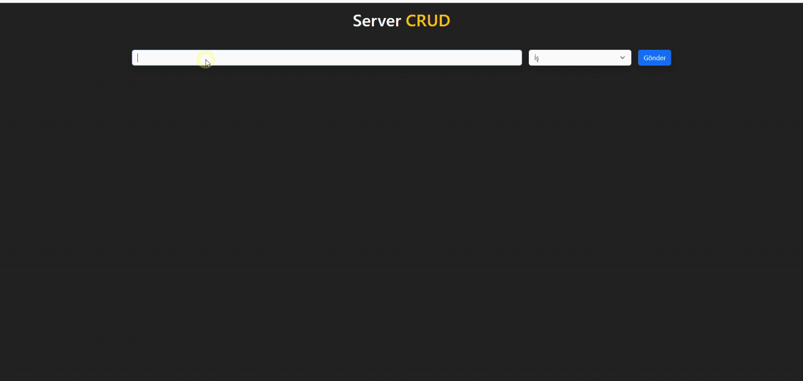

# Server Grud Uygulaması

# Json server ve Axios kullanılmıştır

## json-server kurulum

- json-server --watch db.json --port 3000 komutu ile json-serverı ayağa kaldırdık

### Fetch

```js
fetch('http://localhost:3000/todos')
  .then((res) => res.json())
  .then((data) => setTodos(data));
```

## Axios

- npm install axios
- Yerleşik değil pakedini indirmek gerekli

## Axios GET

```js
axios.post('http://localhost:3000/todos', newTodo);
```

# Ekran görüntüsü

# 
# Server-Grud
